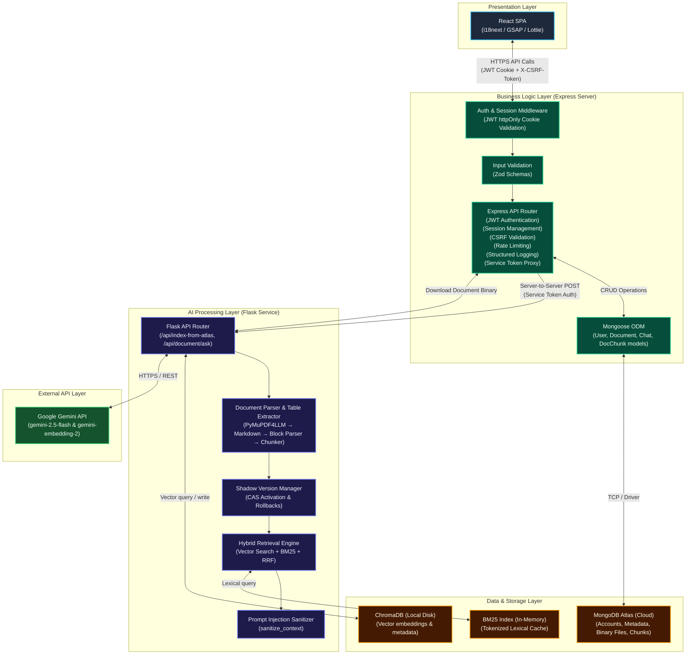
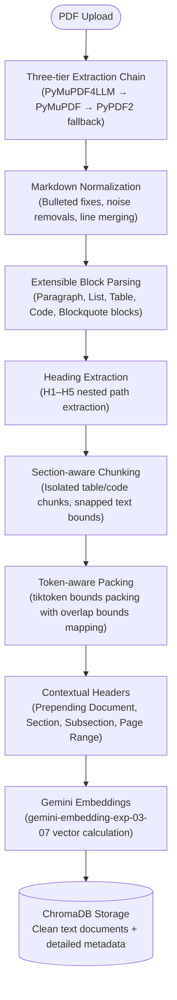

# SmartDocQ — AI Document Assistant | Document Intelligence & Summarization Platform

**Live Demo:** [https://smartdocq.vercel.app](https://smartdocq.vercel.app)

In today's information-driven world, efficiently extracting insights from documents is crucial for academic success and professional productivity. The growing volume of digital documents presents challenges in comprehension, knowledge retention, and information retrieval. SmartDocQ is an intelligent document processing platform that leverages advanced AI technology to transform how users interact with their documents.

## Overview

SmartDocQ is a full-stack AI document intelligence platform that combines structured document processing with a Hybrid Retrieval-Augmented Generation (Hybrid RAG) architecture. By integrating semantic vector search, BM25 lexical retrieval, and Reciprocal Rank Fusion (RRF), it delivers accurate, context-aware answers across both narrative documents and structured tabular data.

## Features

### Core AI Features
- **AI-Powered Chat**: Hybrid RAG-based question answering using Vector Search + BM25 + RRF Fusion.
- **Quiz Generation**: Automatic creation of multiple-choice, true/false, and short-answer questions from document content.
- **Flashcard Creation**: Smart extraction of key concepts and definitions for effective learning and revision.
- **Text Summarization**: Concise summaries of document content for quick comprehension.

### Indexing & Retrieval
- **Document Upload & Processing**: Support for PDF, DOC, DOCX, TXT, CSV, and XLSX files with intelligent text extraction and preprocessing.
- **Advanced PDF Indexing Pipeline**:
  - **PyMuPDF4LLM Markdown extraction** for high-quality structure conversion.
  - **Heading-aware section detection** (traces H1-H5 hierarchy).
  - **Block-aware token chunking** preserving list, code, table, and paragraph bounds.
  - **Contextual document embeddings**: Prepend document title, hierarchical headings, and page ranges before embedding, improving retrieval quality while preserving the original chunk text for generation.
  - **Rich metadata indexing** and duplicate filtering.
- **Hybrid Retrieval Engine**: Combines semantic vector search, version-isolated BM25 lexical search with in-memory caching, and Reciprocal Rank Fusion (RRF) for higher retrieval accuracy.
- **Spreadsheet & Table Intelligence**: Extracts and indexes structured data from CSV, XLSX, and DOCX tables for table-aware question answering.
- **Atomic Shadow Indexing**: Builds new vector generations in isolation, validates them across ChromaDB and BM25, performs compare-and-swap (CAS) activation, and automatically rolls back failed builds without interrupting retrieval.

### Security
- **Session-Bound CSRF Protection**: Custom double-submit cookie protection with session-bound SHA-256 token validation, timing-safe comparisons, and Origin/Referer verification to prevent Cross-Site Request Forgery attacks.
- **Defense-in-Depth Request Validation**: Authenticated state-changing requests are protected by session-bound double-submit CSRF tokens, Origin/Referer validation, timing-safe comparisons, and per-user rate limiting.
- **Internal AI Service Authentication**: All browser requests are routed through the Node.js backend. The Flask AI service accepts only authenticated server-to-server requests protected with a shared `SERVICE_TOKEN`, preventing direct client access to AI endpoints.
- **Sensitive Data Detection**: Automatic identification of personal information (emails, phone numbers, Aadhaar, PAN, credit cards, SSN).
- **User Consent Workflow**: Privacy-first approach requiring explicit consent before processing sensitive documents.
- **Content Moderation**: Profanity filtering and URL validation to maintain platform integrity.
- **Jailbreak Attempt Filtering**: Blocks common prompt-injection/jailbreak phrases in user questions before invoking retrieval/LLM.
- **Prompt Injection Mitigation**: Document content is sanitized before LLM processing and treated as untrusted input.
- **Hardened Error Handling**: Production-safe error responses return generic messages to clients while logging full server-side tracebacks. Detailed exception text is exposed only when `FLASK_DEBUG=1`, reducing information leakage and protecting internal service details.
- **httpOnly Cookie Authentication**: Secure user sessions with role-based access control (User, Admin, Moderator).
- **Server-Side Session Management**: Server-side session management with session invalidation and "logout from all devices" support.
- **Centralized Server-Side Validation**: Auth and admin APIs validate all inputs with Zod schemas before any business logic or database access.
- **Strict Admin Authorization**: Admin endpoints are protected by middleware that requires an authenticated user with `isAdmin = true`; there are no hardcoded admin credentials or token backdoors.
- **Authentication Rate Limiting**: Sensitive auth endpoints (login, signup, password resets) are rate-limited per IP to prevent brute-force attacks.
- **User Enumeration Protection**: Authentication endpoints utilize unified, generic error responses to avoid leaking database user existence.
- **Optimistic Locking & Recovery**: Processing jobs use optimistic versioning and watchdog recovery to prevent race conditions and automatically recover stalled indexing tasks.

### Administration
- **User Management**: Comprehensive admin dashboard for user oversight and role assignment.
- **Document Analytics**: Track document uploads, processing status, and usage statistics.
- **Report Management**: Handle user feedback and support inquiries efficiently.
- **System Monitoring**: Structured request logging (Pino), Prometheus metrics, health checks, and background maintenance jobs.

---

## System Architecture



---

## Technology Stack

### Frontend
- **React.js 18.x**: Modern component-based UI framework
- **React Router DOM**: Client-side routing and navigation
- **i18next**: Internationalization support
- **GSAP & Lottie**: Smooth animations and interactive elements
- **Focus Trap React**: Accessibility features

### Backend (Node)
- **Node.js & Express 5.x**: RESTful API server
- **Mongoose 8.x**: MongoDB object modeling
- **JWT & bcryptjs**: Authentication and password security
- **Multer**: File upload handling
- **Helmet**: Security-oriented HTTP response headers
- **Compression**: gzip response compression for payloads > 1 KB
- **Pino**: Structured request and error logging
- **CORS**: Cross-origin resource sharing configuration
- **express-rate-limit**: API rate limiting for public sharing and authentication endpoints

### AI Service
- **Flask 3.x**: Python web framework for AI processing
- **Google Gemini 2.5 Flash**: Advanced text generation and comprehension
- **models/gemini-embedding-2**: High-quality vector embeddings
- **ChromaDB 0.5+**: Vector database for semantic retrieval
- **BM25 Retrieval Layer**: Fast keyword and identifier-based search
- **Reciprocal Rank Fusion (RRF)**: Hybrid ranking engine combining vector and lexical retrieval
- **PyMuPDF4LLM / PyMuPDF**: Structural Markdown extractors
- **tiktoken**: Token packing estimation

### Document Processing
- **PyMuPDF4LLM**: Markdown layout converter
- **PyMuPDF (fitz)**: Page-level structural extraction fallback
- **PyPDF2**: Backup PDF text extraction
- **python-docx**: Microsoft Word document processing
- **openpyxl**: Spreadsheet processing and table extraction
- **Structured Table Extraction**: CSV, XLSX, and DOCX table indexing
- **Better Profanity**: Content filtering

### Storage
- **MongoDB Atlas**: Primary NoSQL database for user data, documents, and chat history
- **ChromaDB**: Vector store for document embeddings and semantic retrieval

---

## ADVANCED PDF INDEXING PIPELINE

To handle complex manuals and academic textbooks, SmartDocQ uses a specialized, stage-based indexing pipeline:



---

## Index Lifecycle Management

The Flask AI service includes automatic vector index lifecycle management to maintain retrieval quality as embedding models and preprocessing logic evolve.

Each ChromaDB vector stores detailed structural metadata. Before retrieval, SmartDocQ verifies vector compatibility and automatically triggers background reindexing when stale or incompatible vectors are detected.

**This prevents:** silent retrieval degradation when upgrading embedding models or modifying chunking and preprocessing strategies.

### Shadow Index Lifecycle
SmartDocQ uses versioned shadow indexing to ensure retrieval remains available during reindexing.

Each reindex creates a completely isolated index generation containing:
- ChromaDB vectors
- BM25 lexical index
- Chunk metadata

The active index continues serving queries while the new generation is built.

Once validation succeeds:
- Compare-and-swap (CAS) activation atomically promotes the new version
- Previous version is retained for rollback
- Obsolete generations are cleaned asynchronously

If validation fails:
- Active retrieval is unaffected
- Failed generation is discarded
- Previous active generation continues serving requests

### Supported Versioning Metadata
- `embedding_model` — e.g. `models/gemini-embedding-2`
- `pipeline_version` — indexing pipeline config changes
- `chunking_version` — data schema version tracking
- `indexed_at` — timestamp of indexing
- `file_hash` — source file content hash to detect changes
- `section` / `subsection` — dynamic layout coordinates
- `start_page` / `end_page` — page range boundaries

---

## Retrieval Architecture

Retrieval is always performed against the currently active index generation, ensuring background reindexing never interrupts user queries.

SmartDocQ uses a Hybrid RAG pipeline that combines:
- **Semantic vector retrieval** (ChromaDB + gemini-embedding-2)
- **Version-isolated BM25 lexical retrieval** with in-memory caching
- **Reciprocal Rank Fusion (RRF)**
- **Table-aware reranking**
- **Contextual document embeddings** (Document, Section, Subsection, Page Ranges)

This approach improves both semantic understanding and exact-match retrieval for identifiers, spreadsheet data, and structured documents.

---

## Requirements

To set up SmartDocQ locally, you'll need:
- **Node.js**: Version 20.x or higher
- **Python**: Version 3.9 or higher
- **MongoDB**: Local installation or MongoDB Atlas account
- **Google AI API Key**: For Gemini AI access
- **Git**: Version control

---

## Local Setup Instructions

### 1. Fork & Clone Repository
```bash
git clone https://github.com/your-username/SmartDocQ.git
cd SmartDocQ
```

### 2. Backend Middleware Setup (Node API)
```bash
cd servers
npm install

# Create .env file with the following variables:
# PORT=5000
# MONGO_URI=your_mongodb_connection_string
# JWT_SECRET=your_jwt_secret_key
# FRONTEND_ORIGINS=http://localhost:3000
# DNS_SERVERS=1.1.1.1,8.8.8.8
# SERVICE_TOKEN=shared_strong_secret
# FLASK_ASK_URL=http://localhost:5001/api/document/ask
# FLASK_INDEX_URL=http://localhost:5001/api/index-from-atlas
# FLASK_CONVERT_URL=http://localhost:5001/api/convert/word-to-pdf
# MAX_UPLOAD_SIZE_MB=15
# MAIL_USER=your_gmail_address (required in development only)
# MAIL_PASS=your_gmail_app_password (required in development only)
# RESEND_API_KEY=your_resend_api_key (required in production only)

npm start
```

### 3. AI Service Setup (Flask)

React communicates only with Node.js. The Flask service is intended for internal server-to-server communication and should not be called directly by browser clients.

```bash
cd ../backend
python -m venv venv
source venv/bin/activate  # On Windows: venv\Scripts\activate
pip install -r requirements.txt

# Create .env file with:
# PORT=5001
# FRONTEND_ORIGINS=http://localhost:3000
# NODE_BASE_URL=http://localhost:5000
# SERVICE_TOKEN=shared_strong_secret (must be identical to the SERVICE_TOKEN in servers/.env)
# GEMINI_API_KEY=your_google_ai_api_key
# INDEX_BATCH_SIZE=64
# MAX_UPLOAD_SIZE_MB=15

# Optional chunking configurations:
# CHUNK_TARGET_TOKENS=512
# CHUNK_SOFT_LIMIT=600
# CHUNK_HARD_LIMIT=800
# CHUNK_OVERLAP_TOKENS=80
# IGNORE_REFERENCE_SECTIONS=True

python main.py
```

### 4. Frontend Setup (React)
```bash
cd ../my-app
npm install

# Create .env file with:
# REACT_APP_API_URL=http://localhost:5000
# REACT_APP_GOOGLE_CLIENT_ID=your_google_oauth_client_id

npm start
```

---

## Running Tests

Run the Python test suite (Flask AI service):
```bash
cd backend
# Set SERVICE_TOKEN (PowerShell: $env:SERVICE_TOKEN="dev-token")
python -m pytest tests/ -v
```

---

## Observability

SmartDocQ includes built-in latency instrumentation for every retrieval request.

Captured metrics include:
- embedding latency
- Chroma retrieval latency
- BM25 latency
- RRF fusion latency
- LLM latency
- total request latency

Internal timings are logged server-side while remaining hidden from client responses.

---

## Contributors

Thanks to all the contributors who have helped build SmartDocQ:

<!-- ALL-CONTRIBUTORS-LIST:START -->
<table>
	<tr>
		<td align="center">
			<a href="https://github.com/Dr-Venom29">
				
				<br />
				<sub><b>Dr-Venom29</b></sub>
			</a>
		</td>
		<td align="center">
			<a href="https://github.com/ANIRUDH-7600">
				
				<br />
				<sub><b>ANIRUDH-7600</b></sub>
			</a>
		</td>
		<td align="center">
			<a href="https://github.com/sameekhsa">
				
				<br />
				<sub><b>sameekhsa</b></sub>
			</a>
		</td>
		<td align="center">
			<a href="https://github.com/ananya-1507">
				
				<br />
				<sub><b>ananya-1507</b></sub>
			</a>
		</td>
		<td align="center">
			<a href="https://github.com/srithi-05">
				
				<br />
				<sub><b>srithi-05</b></sub>
			</a>
		</td>
	</tr>
</table>
<!-- ALL-CONTRIBUTORS-LIST:END -->
