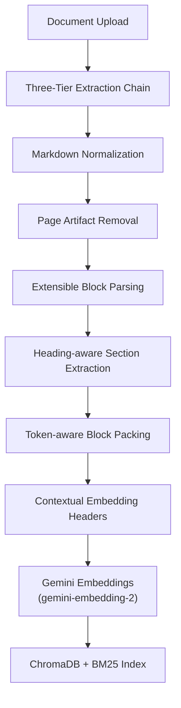
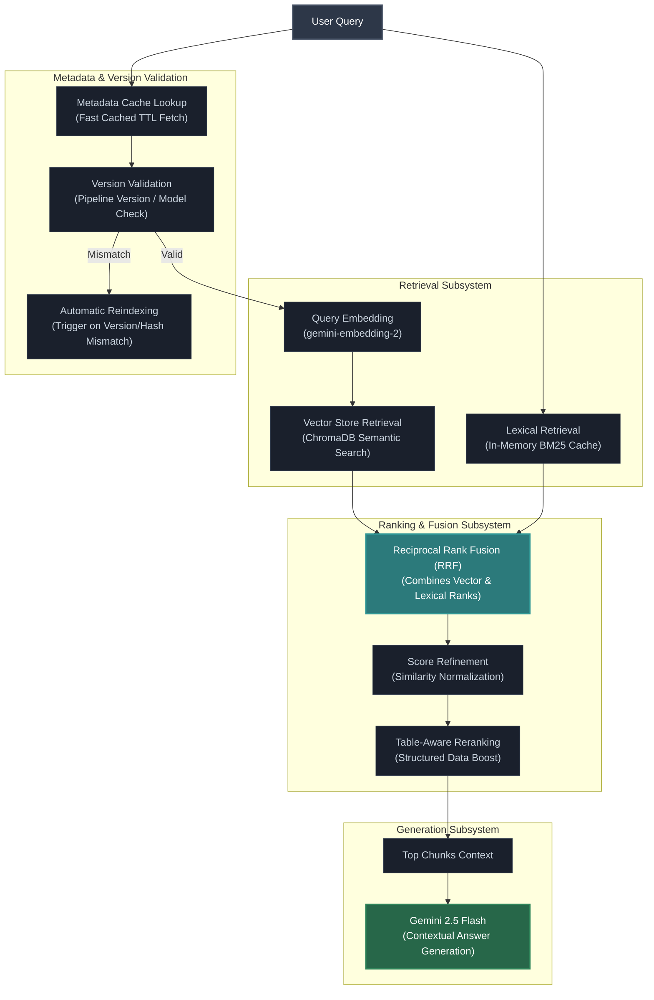

# SmartDoc AI Service (Python/Flask backend)

## Environment Variables

Copy `.env.example` to `.env` and configure:

- `PORT` — Port for the AI service (default: `5001`)
- `FRONTEND_ORIGINS` — Comma-separated CORS allowlist (e.g., `http://localhost:3000,https://your-frontend.vercel.app`)
- `NODE_BASE_URL` — Base URL of the trusted Node.js API used for authenticated document downloads, metadata access, and indexing callbacks.
- `SERVICE_TOKEN` — Shared secret used to authenticate all server-to-server communication between the Node.js backend and the Flask AI service. This value must be identical in both services.
- `GEMINI_API_KEY` — Google Generative AI API key
- `TEXT_MODEL` — Optional override for the Gemini text model (default: `models/gemini-2.5-flash`)
- `EMBED_MODEL` — Optional override for the embedding model (default: `models/gemini-embedding-2`)
- `INDEX_BATCH_SIZE` — Optional Chroma flush size during indexing (default: `64`)
- `JAILBREAK_THRESHOLD` — Optional weighted threshold for jailbreak detection (default: `3`)
- `BM25_CACHE_TTL` — Optional BM25 cache lifetime in seconds (recommended: 86400)

## Installation & Run

Create and activate a virtual environment, then install dependencies:

```bash
pip install -r requirements.txt
```

Start the AI service:

```bash
python main.py
```

The service runs on port `5001` by default.

## Dependencies

SmartDocQ AI Service leverages modern libraries to implement a resilient document understanding and search interface:
- **PyMuPDF4LLM / PyMuPDF (fitz)**: Multi-format PDF layout parser converting PDF text and tables to Markdown.
- **PyPDF2**: Fallback PDF text parser.
- **tiktoken**: Fast byte pair encoding (BPE) tokenizer used for chunk bounds estimation.
- **rank-bm25**: Lexical BM25 indexing and querying.
- **ChromaDB**: High-performance semantic vector database.

## Health Check

- `GET /healthz` → `{ "status": "ok" }`
  - **Public endpoint**. Does not require `SERVICE_TOKEN`.
- `GET /` → `{ "service": "SmartDocQ Flask", "status": "ok" }`
  - **Public endpoint**. Does not require `SERVICE_TOKEN`.


## RESILIENT PDF EXTRACTION

PDF processing is critical to a document RAG system. SmartDocQ implements a robust **Three-tier PDF Extraction Chain** to ensure processing never fails entirely:

1. **Tier 1: PyMuPDF4LLM** (Default) — Extracts text and tables, converting them to rich Markdown structured page-by-page.
2. **Tier 2: PyMuPDF Classic** (Fallback 1) — Used if Tier 1 conversions encounter layout errors, converting raw text page-by-page.
3. **Tier 3: PyPDF2 Reader** (Fallback 2) — Final backup library returning raw unformatted page text if Fitz modules fail to load.

---

## INDEXING PIPELINE & FEATURES

SmartDocQ processes incoming uploads page-by-page through a structured Markdown indexing pipeline:



### Key Indexing Features
- **Markdown Normalization**: standardizes bullets, cleans fences, reduces extra lines, and merges wrapped lines.
- **Page Artifact Removal**: strips running headers/footers and automatic page numbers before parsing.
- **Heading-aware Section Extraction**: dynamically traces heading hierarchies and subsection paths.
- **Extensible Block Parsing**: supports paragraphs, headings, tables, lists, blockquotes, code blocks, HTML blocks, and display equations.
- **Token-aware Block Packing**: splits documents on natural Markdown syntax boundaries rather than arbitrary characters.
- **Token-aware Chunk Sizing**: Packs content up to standard token boundaries dynamically estimated using `tiktoken`.
- **Dedicated Table Chunks**: keeps tables isolated, splitting large tables by row groups and repeating column headers on every sub-chunk.
- **Dedicated Code Chunks**: keeps code blocks isolated to prevent Markdown code fence corruption.
- **Dedicated HTML Blocks**: preserves HTML blocks as isolated units.
- **Dedicated Equation Blocks**: preserves display equations as isolated units.
- **Contextual Embedding Headers**: prepends document title, section, subsection, and page ranges to query vector generation.
- **Rich Metadata Store**: records all structural page coordinates, counts, hashes, and pipeline versions.
- **Automatic Duplicate Removal**: filters out repeated noise blocks.
- **Automatic Version Validation**: enforces Vector index compatibility checks.

---

## HYBRID RETRIEVAL WORKFLOW

The SmartDocQ hybrid retrieval engine fuses semantic similarity results with lexical index matching, incorporating table-aware relevance weighting and dynamic metadata validation checks:



### Contextual Chunk Headers

Before sending chunks to the embedding model, SmartDocQ prepends a structural context block to the embedding input:
```text
Document: [filename]
Section: [H1 Section Title]
Subsection: [H2 > H3 Subsection Path]
Pages: [Page / Page Range]
```
This contextual prepending guarantees that relevant facts are retrieved correctly even when page-level chunks lack direct textual keywords. In contrast, ChromaDB stores clean chunk text as documents to prevent lexical BM25 search pollution.

---

## RETRIEVAL QUALITY FEATURES

- **Hybrid Retrieval** (Vector + BM25)
- **Reciprocal Rank Fusion (RRF)**
- **Table-Aware Retrieval**
- **Contextual Chunk Headers** (Section, Subsection, Page Range)
- **Block-aware Chunking**
- **Context-preserving Block Parsing**
- **Section-aware Indexing**
- **Page-aware Metadata**
- **Automatic Header/Footer Removal**
- **Automatic PDF Fallback Chain**
- **Token-aware Chunk Sizing**
- **Automatic Index Version Validation**

---

## SECURITY FEATURES

- **Server-to-Server Authentication**: All AI endpoints require a valid shared `SERVICE_TOKEN`. Browser clients cannot invoke protected Flask APIs directly.
- **Constant-Time Token Verification**: Incoming service tokens are validated using `hmac.compare_digest` to mitigate timing attacks.
- **Layered Authorization Model**: JWT authentication, document ownership checks, and rate limiting are enforced by the Node.js backend before requests reach the AI service.
- **Audit Identity Forwarding**: Authenticated user IDs are forwarded through the `x-user-id` header for structured logging and future auditing.
- **Secure Temporary File Handling**: Word document conversion and preview operations sanitize user-supplied filenames and use randomized UUID-based temporary filenames with validated extensions, preventing path traversal, arbitrary file writes, and filename collisions.
- Rejects common jailbreak and prompt-manipulation attempts in user questions before retrieval and LLM invocation.
- Treats retrieved document context as untrusted data using guarded `<CONTEXT>` delimiters to reduce document-based prompt injection.
- Detects sensitive data including PAN, Aadhaar, phone numbers, credit cards, emails, and SSN-like patterns.
- Validates credit cards with the Luhn algorithm and Aadhaar numbers with the Verhoeff checksum algorithm to reduce false positives.
- Applies India-focused phone number heuristics for improved detection accuracy.
- Requires explicit user consent before processing documents containing sensitive information.

---

## INDEX LIFECYCLE MANAGEMENT

SmartDocQ tracks detailed version and configuration metadata for every chunk stored in ChromaDB:

- `embedding_model` — embedding model used to generate the vector (e.g., `models/gemini-embedding-2`)
- `pipeline_version` — overall indexing pipeline generation (extraction, parsing, embedding, storage flow)
- `chunking_version` — chunking algorithm generation and chunk layout schema version
- `indexed_at` — UTC timestamp when the chunk was indexed
- `file_hash` — source document content hash used to detect document changes

Before retrieval, the system checks whether stored vectors are compatible with the current configuration.

### Automatic Reindexing Behavior

- **Embedding model changes** trigger automatic background reindexing and temporarily block retrieval because vectors generated by different models are mathematically incompatible.
- **Pipeline version changes** trigger background reindexing while continuing to serve the existing index.
- **Source document content changes** (file hash mismatch) trigger automatic reindexing.
- **Legacy chunks** without version metadata remain backward compatible and are upgraded automatically.

---

## TESTING

Note: `SERVICE_TOKEN` is required to import some modules; set it in your environment (a dummy value is fine for unit tests).

Run the full automated unit test suite:

```bash
python -m pytest
```

Or run specific test modules in verbose mode:

```bash
# Run chunking unit tests (blocks, tables, code splitting, overlap)
python -m pytest tests/test_chunking.py -v

# Run indexing pipeline unit tests (PDF extraction chain fallbacks, metadata)
python -m pytest tests/test_indexer.py -v

# Run retrieval unit tests (hybrid search, BM25, metadata caching)
python -m pytest tests/test_retrieval_service.py -v

# Run security checks tests (sensitive detectors, Aadhaar, CC verification)
python -m pytest tests/test_security.py -v

# Run vector store versioning and lifecycle tests
python -m pytest tests/test_vector_versioning.py -v
```

## INDEXING ARCHITECTURE

- `indexer.py` — orchestration, dispatch, storage finalization, and public indexing entrypoints
- `pipeline.py` — extraction, metadata construction, embedding preparation, and storage pipeline primitives
- `chunking.py` — normalization, page cleanup, block parsing, section extraction, and chunk packing
- `background.py` — asynchronous indexing workflow and consent-aware background execution
