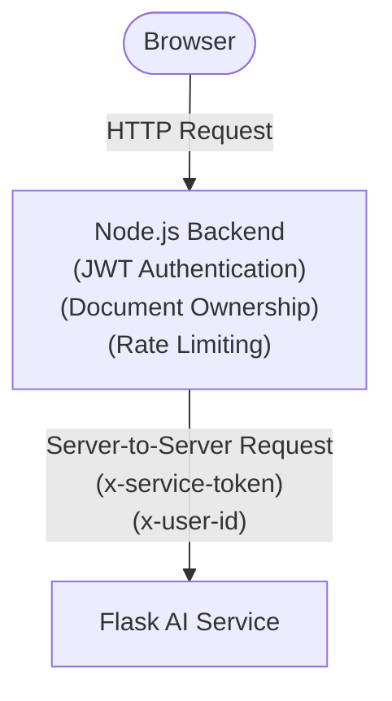
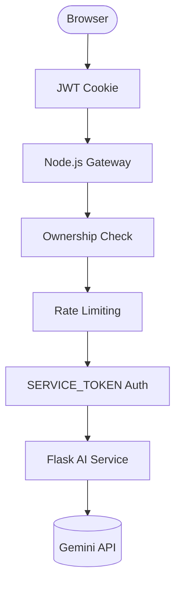

# SmartDoc Node API (servers/)

## Environment variables
Copy `.env.example` to `.env` and fill in:

- PORT: default 5000
- MONGO_URI: MongoDB Atlas connection string
- JWT_SECRET: strong random secret for signing auth cookies
- FRONTEND_ORIGINS: comma-separated allowlist for CORS (e.g., http://localhost:3000, https://your-frontend.vercel.app)
- FRONTEND_URL: base URL used when generating password-reset links (e.g., https://smartdocq.vercel.app)
- CLOUDINARY_*: optional for avatars
- DNS_SERVERS: optional comma-separated DNS servers for Node's resolver (e.g., `1.1.1.1,8.8.8.8`) if Atlas lookups fail with `querySrv ECONNREFUSED`
- SERVICE_TOKEN: Shared secret used to authenticate all server-to-server communication with the Flask AI service (must match the Flask backend's `SERVICE_TOKEN` exactly). The browser never receives or uses this token.
- FLASK_BASE_URL (or PY_API_URL / FLASK_URL): Base URL of the Flask AI service (e.g., `http://localhost:5001`). Used to derive the base URL for proxying quiz, flashcard, text summarization, and PDF preview requests.
- FLASK_ASK_URL, FLASK_INDEX_URL, FLASK_CONVERT_URL: Specific override Flask service endpoints. If `FLASK_BASE_URL` is configured, these default to paths on that base URL.

## Authentication
Uses httpOnly cookies for JWT storage. All AI endpoints require a valid authenticated session before requests are forwarded to the Flask AI service. Key endpoints:
- POST `/api/auth/login` — Sets auth cookie
- POST `/api/auth/logout` — Clears auth cookie
- GET `/api/auth/verify` — Validates session from cookie

## AI Service Gateway

The Node.js backend acts as the single entry point for all AI functionality.

The browser never communicates directly with the Flask AI service. Node authenticates users, validates document ownership, enforces request limits, and securely proxies requests to Flask using a shared `SERVICE_TOKEN`.

## Request Flow

## Security Controls

### Authentication Rate Limiting
- Core authentication routes (`login`, `signup`, `forgot-password`, `reset-password`, `google`) are protected by an `express-rate-limit` guard restricting IPs to 30 authentication-related requests per 15 minutes.
- **Enumeration Protection**: Login failures return generic `"Invalid email or password"` responses to prevent scanning/enumeration of active emails.
- **Google OAuth Compatibility**: Safe checks prevent server crashes during credential comparison or profile updates for accounts created via Google Sign-In.

### AI Endpoint Protection
- AI requests are authenticated using JWT httpOnly cookies.
- Document ownership is verified before forwarding requests.
- Browser clients cannot directly access protected Flask endpoints.
- Requests forwarded to Flask include a shared `SERVICE_TOKEN`.
- Authenticated user identifiers are forwarded through the `x-user-id` header for auditing.

### AI Request Rate Limiting
The following limits are enforced before requests reach the AI service:
- Chat: 60 requests/minute
- Summarization: 20 requests/minute
- Quiz generation: 5 requests/minute
- Flashcard generation: 5 requests/minute

## Validation & Responses
- Auth and admin routes use centralized Zod schemas via a `validate` middleware to enforce strict shapes for `body`, `query`, and `params`.
- Successful API responses include `success: true` along with any payload fields.
- Failed responses include `success: false`, a human-readable `message`, and, for validation failures, an `errors` array with structured details.

## Scripts
- `npm start` to run the server (default port 5000)

## Health
- GET /healthz returns `{ "status": "ok" }` (Public endpoint; does not require JWT or SERVICE_TOKEN).

## Public share links

SmartDoc supports sharing a read-only snapshot of a document chat via a public link.

- Create share (auth required): `POST /api/share/chat/:documentId`
	- Returns `{ shareId, title }`
- View share (public): `GET /api/share/:shareId`
- Export share as PDF (public): `GET /api/share/:shareId/export.pdf`

### Security

- Share links expire after ~24 hours (`410` if expired).
- Share IDs are high-entropy URL-safe strings (currently 32 chars base64url); legacy shorter IDs may still resolve.
- Public share endpoints are rate-limited (100 requests/min per IP) to prevent abuse.
