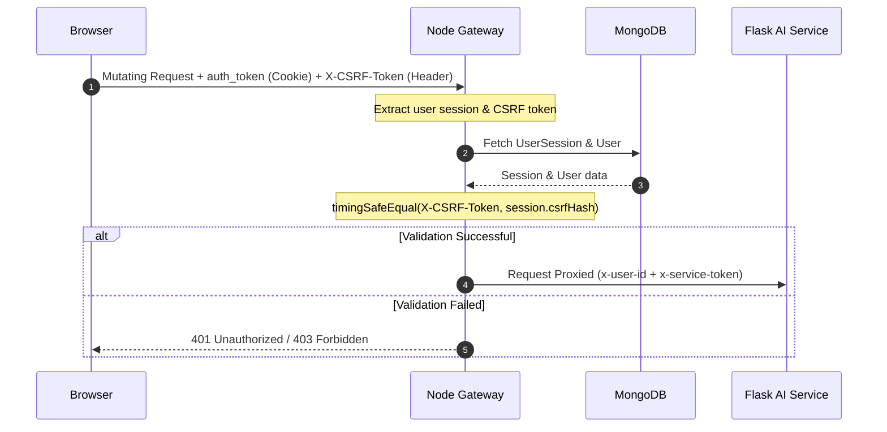
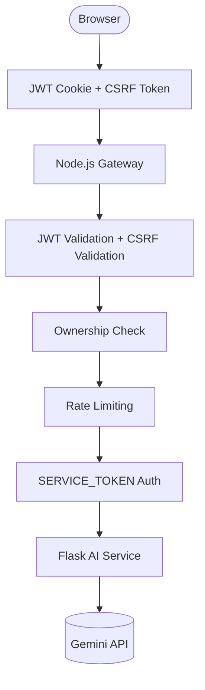

# SmartDoc Node API (servers/)

## Environment variables
Copy `.env.example` to `.env` and fill in:

- PORT: default 5000
- MONGO_URI: MongoDB Atlas connection string
- JWT_SECRET: strong random secret for signing auth cookies
- FRONTEND_ORIGINS: comma-separated allowlist for CORS (e.g., http://localhost:3000, https://your-frontend.vercel.app)
- FRONTEND_URL: base URL used when generating password-reset links (e.g., https://smartdocq.vercel.app)
- CLOUDINARY_*: optional for avatars
- DNS_SERVERS: optional comma-separated DNS servers for Node's resolver (e.g., `1.1.1.1,8.8.8.8`) if Atlas lookups fail with `querySrv ECONNREFUSED`
- SERVICE_TOKEN: Shared secret used to authenticate all server-to-server communication with the Flask AI service (must match the Flask backend's `SERVICE_TOKEN` exactly). The browser never receives or uses this token.
- FLASK_BASE_URL (or PY_API_URL / FLASK_URL): Base URL of the Flask AI service (e.g., `http://localhost:5001`). Used to derive the base URL for proxying quiz, flashcard, text summarization, and PDF preview requests.
- FLASK_ASK_URL, FLASK_INDEX_URL, FLASK_CONVERT_URL: Specific override Flask service endpoints. If `FLASK_BASE_URL` is configured, these default to paths on that base URL.
- LOG_LEVEL: Optional Pino log level (e.g., `info`, `warn`, `error`, `debug`; default: `info`).
- NODE_ENV: Application environment (e.g., `development`, `production`).
- MAX_UPLOAD_SIZE_MB: Maximum upload size accepted by the Node gateway (default: `15`).
- MAIL_USER: Gmail address used by Nodemailer (development only)
- MAIL_PASS: Google App Password used by Nodemailer (development only)
- BREVO_API_KEY: API key for Brevo Transactional Email HTTPS API (production only)
- BREVO_SENDER_EMAIL: Verified sender email address configured in Brevo dashboard (production only)
- BREVO_SENDER_NAME: Optional sender display name (default: `SmartDocQ`)

## Email Infrastructure
SmartDocQ features a dual-provider abstraction architecture inside `services/mailService.js`.
Depending on the environment configuration, the gateway selects the corresponding provider at boot time:
* **Development (`NODE_ENV !== "production"`)**: Dynamically resolves to `gmailProvider.js` utilizing **Gmail SMTP** via Nodemailer (port 465, SSL/TLS, custom timeouts).
* **Production (`NODE_ENV === "production"`)**: Dynamically resolves to `brevoProvider.js` utilizing the official **Brevo Transactional Email API** (`sib-api-v3-sdk`) over port 443.
This architecture ensures Gmail SMTP is never loaded in production and the Brevo HTTPS client is never initialized in development, maintaining a clean runtime state and full compatibility with outbound port blocks (e.g. on Render Free).

```mermaid
graph TD
    subgraph Development [Development Environment]
        CallDev[Call sendPasswordResetEmail] --> MailDev[mailService.js]
        MailDev -->|isProduction = false| Gmail[gmailProvider.js]
        Gmail -->|Gmail SMTP port 465| SmtpGmail[Google SMTP Server]
    end
    subgraph Production [Production Environment]
        CallProd[Call sendPasswordResetEmail] --> MailProd[mailService.js]
        MailProd -->|isProduction = true| Brevo[brevoProvider.js]
        Brevo -->|Brevo SDK HTTPS port 443| ApiBrevo[Brevo Transactional Email API]
    end
```

## Authentication & Session Management
Uses secure HTTP-Only cookies for JWT storage coupled with database-backed session tracking in MongoDB. All AI endpoints require a valid authenticated session before requests are forwarded to the Flask AI service.

Key endpoints:
- POST `/api/auth/signup` — Registers a new user
- POST `/api/auth/login` — Creates a session and sets the JWT `auth_token` and `csrf_token` cookies
- POST `/api/auth/logout` — Revokes the current session and clears cookies
- POST `/api/auth/logout-all` — Revokes all active database sessions for the user (invalidation)
- GET `/api/auth/verify` — Validates the session from cookies

### Session Security & Validation Flow
Each login creates an active `UserSession` record in MongoDB.
Sessions store:
- Device name (parsed from User-Agent)
- IP address
- Last activity timestamp
- Expiration date
- CSRF token hash

Sessions are automatically invalidated on logout, logout-all, and password reset.

### Password Security & Reset
- **Password Reset Flow**: Requesting a password reset generates a cryptographically secure 32-byte token that is SHA-256 hashed before database storage.
- **Expiration**: Reset tokens expire after 15 minutes and are single-use.
- **Secure Changed Notifications**: Successfully resetting a password invalidates all other active sessions and sends a best-effort transactional email notification detailing the action timestamp.

### Google Authentication
- Supports Google Sign-In via token verification.
- Existing local accounts are automatically linked by email.
- Accounts created exclusively via Google OAuth cannot use local password resets unless a password is explicitly configured on the profile.

## AI Service Gateway

The Node.js backend acts as the single entry point for all AI functionality.

The browser never communicates directly with the Flask AI service. Node authenticates users, validates document ownership, enforces request limits, and securely proxies requests to Flask using a shared `SERVICE_TOKEN`.

## Request Flow

## Security Controls

### Authentication Rate Limiting
- Core authentication routes (`login`, `signup`, `forgot-password`, `reset-password`, `google`) are protected by an `express-rate-limit` guard restricting IPs to 30 authentication-related requests per 15 minutes.
- **Enumeration Protection**: Login failures return generic `"Invalid email or password"` responses to prevent scanning/enumeration of active emails.
- **Google OAuth Compatibility**: Safe checks prevent server crashes during credential comparison or profile updates for accounts created via Google Sign-In.

### CSRF Protection

Authenticated state-changing requests (POST, PUT, PATCH, DELETE) are protected using a custom session-bound Double-Submit Cookie CSRF implementation.

Security features include:

- Session-bound CSRF tokens generated using cryptographically secure random bytes.
- SHA-256 hash of each CSRF token stored in the active `UserSession`.
- Timing-safe token comparison using `crypto.timingSafeEqual`.
- Automatic `X-CSRF-Token` validation on authenticated mutating requests.
- Origin/Referer validation for defense in depth.
- Trusted internal Flask service requests authenticated with `x-service-token` bypass CSRF validation.

### AI Endpoint Protection
- AI requests are authenticated using JWT httpOnly cookies.
- Document ownership is verified before forwarding requests.
- Browser clients cannot directly access protected Flask endpoints.
- Requests forwarded to Flask include a shared `SERVICE_TOKEN`.
- Authenticated user identifiers are forwarded through the `x-user-id` header for auditing.

### AI Request Rate Limiting
The following limits are enforced before requests reach the AI service:
- Chat: 60 requests/minute
- Summarization: 20 requests/minute
- Quiz generation: 5 requests/minute
- Flashcard generation: 5 requests/minute

## Validation & Responses
- Auth and admin routes use centralized Zod schemas via a `validate` middleware to enforce strict shapes for `body`, `query`, and `params`.
- Successful API responses include `success: true` along with any payload fields.
- Failed responses include `success: false`, a human-readable `message`, and, for validation failures, an `errors` array with structured details.

## Scripts
- `npm install` to install dependencies
- `npm start` to run the server (default port 5000)

## Logging
The API uses Pino for structured logging.
- **Production**: Structured JSON logs. Sensitive fields (`password`, `token`, `refreshToken`, `accessToken`, `csrfToken`, `secret`, `clientSecret`, `apiKey`) and cookie/authorization headers are redacted.
- **Development**: Pretty-colored, human-readable terminal output.
- **Automatic Requests**: Logs method, url, status code, and execution time (e.g., `POST /api/auth/login 200 320ms`). Ignores preflight `OPTIONS` requests.

## HTTP Security
The API applies Helmet to enable standard HTTP security headers:
- X-Content-Type-Options
- X-Frame-Options
- Referrer-Policy
- Cross-Origin policies

*Note: Content Security Policy (CSP) is disabled (`contentSecurityPolicy: false`) because the React frontend integrates with external assets and services like Google OAuth and Cloudinary.*

## Response Compression
Responses larger than 1 KB are automatically compressed using `gzip` to reduce bandwidth and improve load times.

## Health & Metrics
- **Health check**: `GET /healthz` (Public endpoint).
  - **Production**: Returns `{ "status": "ok" }`.
  - **Development**: Returns status along with `uptime`, `mongodb` connection status, and application `version` (npm package version).
- **Metrics**: `GET /metrics` exposes Prometheus metrics. Available only in development by default.

## Graceful Shutdown
The server supports graceful shutdown. Upon receiving a `SIGINT` or `SIGTERM` signal, it:
1. Stops accepting new HTTP requests.
2. Clears background `setInterval` timers.
3. Closes the MongoDB client connection cleanly.
4. Forces process exit after 10 seconds if any connection hangs.

## Background Jobs
Runs lightweight background tasks on interval:
- **Shared Chat Cleanup**: Deletes expired public share records hourly.
- **Stale Document Watchdog**: Runs every 2 minutes to mark documents stuck in processing (`queued`/`indexing`) for more than 10 minutes as `failed`.

## Public share links

SmartDoc supports sharing a read-only snapshot of a document chat via a public link.

- Create share (auth required): `POST /api/share/chat/:documentId`
	- Returns `{ shareId, title }`
- View share (public): `GET /api/share/:shareId`
- Export share as PDF (public): `GET /api/share/:shareId/export.pdf`

### Security

- Share links expire after ~24 hours (`410` if expired).
- Share IDs are high-entropy URL-safe strings (currently 32 chars base64url); legacy shorter IDs may still resolve.
- Public share endpoints are rate-limited (100 requests/min per IP) to prevent abuse.
